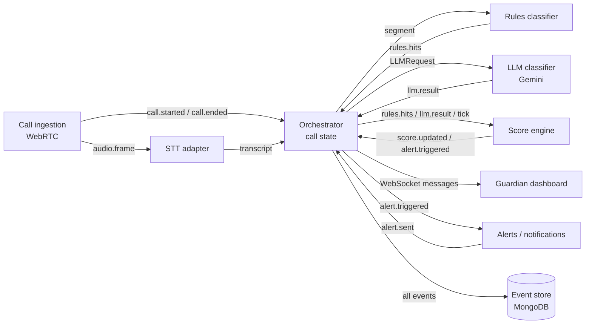

# Guardian Loop: Module Contracts

This document defines the input and output of every module so each person can build
their part in parallel. The rule is simple: **modules only talk to each other through
the events and function signatures below.** If you need a new field, add it here
first and tell the team.

---

## 1. How modules connect

Everything runs in one Node service. Modules communicate through a typed, in-process
event bus (a thin wrapper around Node's `EventEmitter`). Each module subscribes to the
events it needs and publishes its own.



The orchestrator is the only module that holds per-call state. Rules, score engine,
and LLM classifier are written as **pure functions or stateless async functions**,
which makes them easy to build and test in isolation.

---

## 2. Shared types (`packages/shared-types/src/index.ts`)

Everyone imports from this package. Nobody redefines these locally.

```ts
export type CallId = string;              // UUID assigned when the WebRTC session starts
export type Speaker = "caller" | "victim";

export type Signal =
  | "IMPERSONATION" | "URGENCY" | "SECRECY" | "UNTRACEABLE_PAYMENT"
  | "REMOTE_ACCESS" | "CREDENTIAL_REQUEST" | "THREAT"
  | "VICTIM_COMPLIANCE" | "VICTIM_DISCLOSURE" | "VICTIM_RESISTANCE";

export type RiskLevel = "low" | "elevated" | "high";   // 0–39, 40–69, 70–100

export interface Guardian { name: string; phone: string }   // E.164, e.g. "+13055551234"

export interface Turn {                   // one committed (final) utterance
  segmentId: string;
  speaker: Speaker;
  text: string;
  startMs: number;                        // relative to call start
  endMs: number;
}
```

**Conventions**

- `ts` on every event is epoch milliseconds (`Date.now()`).
- `startMs` / `endMs` inside transcripts are milliseconds since the call started.
- All scores are integers from 0 to 100.
- Every event carries `callId`.

**The event bus's type map**

`shared-types` also exports `GuardianEventMap`, which maps each event's `type` literal
to its payload. The bus is typed against it, so publishing an event that isn't in the
map is a compile error:

```ts
export interface GuardianEventMap {
  "call.started": CallStarted;
  "audio.frame": AudioFrame;
  "call.ended": CallEnded;
  transcript: TranscriptEvent;
  // each workstream adds its own events here as they land
}
```

When you add an event to section 3 below, add it to this map in the same PR, or no
module will be able to subscribe to it.

---

## 3. Module contracts

### 3.1 Call ingestion (browser WebRTC)

> **Changed:** Twilio has been dropped from the project. Browser WebRTC is the only
> ingestion path, not a fallback.

**Owns:** the WebRTC signalling server, the browser call page, the audio fork that
carries each participant's own microphone to the server, and the speaker-attribution
gate.

**Input:** two browsers (caller and victim), each capturing its own microphone.
The two peers connect to each other over `RTCPeerConnection` so the participants can
hear one another; separately, each browser forks a copy of **its own** mic to the
server, which is where the three events below come from.

**Output events:**

```ts
interface CallStarted {
  type: "call.started";
  callId: CallId;
  source: "webrtc";
  from?: string;                          // display label, e.g. "room:demo" - not a phone number
  to?: string;
  guardian: Guardian;                     // hard-coded config for the demo
  ts: number;
}

interface AudioFrame {
  type: "audio.frame";
  callId: CallId;
  speaker: Speaker;                       // from the joining role, not guessed
  encoding: "mulaw" | "pcm16";
  sampleRate: 8000 | 16000;
  payload: string;                        // base64 audio, ~20 ms per frame
  seq: number;                            // increasing per speaker
  ts: number;
}

interface CallEnded {
  type: "call.ended";
  callId: CallId;
  reason: "hangup" | "error" | "manual";
  ts: number;
}
```

**Capture format:** `pcm16` at 16 kHz by default. The 8 kHz mu-law option remains
because real scam calls arrive over a phone codec, and it is worth knowing what that
costs in accuracy — but nothing in the demo path needs it.

**Speaker attribution:** the demo has both participants in one room, so each
microphone hears both people. Each browser applies `echoCancellation` and
`noiseSuppression` with `autoGainControl` **off** (AGC raises gain during your
silence, which amplifies the other person). The server then runs a gating automixer:
per 20 ms frame it compares both tracks' RMS and silences the quieter one while the
other is clearly dominant, with a hangover so words are not clipped. Participants
wear close-talking earbud mics, which is what makes the level difference reliable.

**Done when:** two browsers produce `call.started`, a steady stream of `audio.frame`
for both speakers, and `call.ended`; and a conversation held in one room yields
transcripts where each turn is attributed to the right speaker.

---

### 3.2 STT adapter (Scribe / Deepgram / Azure, under test)

**Owns:** vendor connections, reconnection, and translating vendor responses into one
common format. Each vendor gets its own adapter behind the same interface, so
switching vendors is a config change.

**Interface:**

```ts
interface SttAdapter {
  name: "elevenlabs" | "deepgram" | "azure";
  openSession(callId: CallId, speaker: Speaker,
              onTranscript: (e: TranscriptEvent) => void): SttSession;
}

interface SttSession {
  sendAudio(frame: AudioFrame): void;
  close(): Promise<void>;
}
```

**Input:** `audio.frame` events (the orchestrator opens two sessions per call, one per
speaker, and routes frames by `speaker`).

**Output event:**

```ts
interface TranscriptEvent {
  type: "transcript";
  callId: CallId;
  speaker: Speaker;
  segmentId: string;                      // partials share an ID until the final replaces them
  text: string;                           // full text of the segment so far, not a delta
  isFinal: boolean;                       // false = partial, true = committed
  startMs: number;
  endMs: number;
  confidence?: number;                    // 0–1 if the vendor provides it
  ts: number;
}
```

**Done when:** each adapter turns a recorded call into a clean sequence of partials
followed by one final per segment, and survives a dropped connection by reconnecting.

---

### 3.3 Orchestrator (call state and routing)

**Owns:** the event bus, per-call state, the rolling window, when to call the LLM
(trigger policy, debounce, one request in flight), and fan-out to dashboard, store,
and alerts.

**Input:** every event above, plus outputs from rules, LLM, score engine, and alerts.

**Per-call state it maintains:**

```ts
interface CallState {
  callId: CallId;
  guardian: Guardian;
  startedAt: number;
  turns: Turn[];                          // all final turns
  windowSec: number;                      // rolling window for context, e.g. 60
  score: ScoreState;                      // owned by score engine, stored here
  llm: {
    inFlight: boolean;
    dirty: boolean;
    seq: number;
    lastRunAt: number;
    carryContext: string;                 // one line carried between LLM calls
  };
}
```

**Trigger policy (calls the LLM when):**

1. a final segment produces any rule hit,
2. a victim-side compliance or disclosure hit occurs,
3. about 45 seconds of speech pass with no LLM call (heartbeat).

Debounce each trigger by about 1.2 s. Keep at most one LLM request in flight per call,
and drop results whose `seq` is stale.

**Done when:** replaying a fixture file (see section 5) drives the full chain end to
end without any vendor connected.

---

### 3.4 Rules classifier

**Owns:** the pattern list, weights, and speaker scoping.

**Interface (pure function):**

```ts
function runRules(input: { speaker: Speaker; text: string }): RuleHit[];

interface RuleHit {
  ruleId: string;                         // e.g. "payment.gift_card"
  signal: Signal;
  weight: number;                         // points this hit contributes
  match: string;                          // matched text
  start: number;                          // character offsets in `text`,
  end: number;                            //   used for dashboard highlighting
}
```

**Output event (published by the orchestrator after calling `runRules`):**

```ts
interface RulesHitsEvent {
  type: "rules.hits";
  callId: CallId;
  segmentId: string;
  speaker: Speaker;
  isFinal: boolean;                       // partial hits = highlight only; final hits = scoring
  hits: RuleHit[];
  ts: number;
}
```

**Done when:** a unit test suite of scam and legitimate sentences passes, including
common transcription errors ("gift cart").

---

### 3.5 LLM classifier (Gemini)

**Owns:** the system prompt, JSON schema, model settings, and parsing.

**Interface (stateless async function):**

```ts
function classify(req: LLMRequest): Promise<LLMResult>;

interface LLMRequest {
  callId: CallId;
  seq: number;
  trigger: "rule" | "victim" | "heartbeat";
  state: {
    score: number;
    signals: Signal[];
    elapsedSec: number;
    carryContext: string;                 // e.g. "caller claims to be from Medicare"
  };
  turns: Array<{ speaker: Speaker; text: string }>;   // last 4–6 final turns
}

interface LLMResult {
  type: "llm.result";
  callId: CallId;
  seq: number;                            // echoed back for staleness checks
  signals: Signal[];
  score: number;                          // Gemini's own 0–100 estimate
  benignContext: boolean;                 // true if context suggests a legitimate call
  reason: string;                         // one line, max ~15 words
  carryContext: string;                   // updated one-line memory for next call
  latencyMs: number;
  model: string;
  ts: number;
}
```

**Gemini's raw JSON (enforced by response schema):**

```json
{ "signals": ["IMPERSONATION"], "score": 64, "benign_context": false,
  "reason": "Caller claims Medicare and demands action today",
  "carry_context": "Caller claims to be from Medicare" }
```

On error or timeout (about 3 s), resolve with `signals: []` and a `reason` of
`"llm_error"` so the pipeline never blocks.

**Done when:** it returns valid results for every fixture call in under ~1.5 s, and
ignores instructions spoken inside the transcript.

---

### 3.6 Score engine

**Owns:** combining signals, combo bonuses, ratchet-up and decay, and alert firing.

**Interface (pure reducer):**

```ts
function updateScore(
  prev: ScoreState,
  input: RulesHitsEvent | LLMResult | { type: "tick"; ts: number },
  ctx: ScoreContext
): { next: ScoreState; events: Array<ScoreUpdated | AlertTriggered> };

// Per-call facts the orchestrator already holds, passed in so the reducer can emit
// complete events (tick has no callId; alerts need a snippet) while staying pure.
interface ScoreContext {
  callId: CallId;
  startedAt: number;                      // CallState.startedAt, for firstSeenMs
  recentTurns: Array<{ speaker: Speaker; text: string }>;   // last 3 become AlertTriggered.snippet
}

interface ScoreState {
  score: number;
  floor: number;                          // minimum set by hard rule combos; LLM can't go below it
  level: RiskLevel;
  signals: Partial<Record<Signal, { source: "rules" | "llm" | "both"; firstSeenMs: number }>>;   // firstSeenMs: since call start
  alertArmed: boolean;                    // re-arms after score drops well below threshold
  lastReason: string;
}
```

Only final rule hits (`isFinal: true`) affect the score. The orchestrator sends a
`tick` about once per second for decay.

**Output events:**

```ts
interface ScoreUpdated {
  type: "score.updated";
  callId: CallId;
  score: number;
  level: RiskLevel;
  signals: Signal[];
  reason: string;                         // latest human-readable explanation
  source: "rules" | "llm" | "decay";
  ts: number;
}

interface AlertTriggered {
  type: "alert.triggered";
  callId: CallId;
  alertId: string;
  score: number;
  threshold: number;                      // 70 for the demo
  reason: string;
  snippet: Array<{ speaker: Speaker; text: string }>;   // last 2–3 turns
  ts: number;
}
```

**Done when:** unit tests confirm combos (secrecy plus gift cards crosses the
threshold on rules alone), decay, the LLM floor, and exactly one alert per threshold
crossing.

---

### 3.7 Alerts (notifications)

**Owns:** the notification template, sending, and delivery status.

**Input:** `alert.triggered` plus the call's `Guardian`.

**Output event:**

```ts
interface AlertSent {
  type: "alert.sent";
  callId: CallId;
  alertId: string;
  channel: "notification";
  status: "sent" | "failed";              // "sent" = provider accepted it, not device delivery
  providerId?: string;                    // notification provider message ID
  error?: string;
  ts: number;
}
```

**Notification format (body under ~180 characters, so a lock screen shows it all):**

```
Title: ⚠️ Possible scam call (risk 82)
Body:  "Buy the gift cards and don't tell your daughter."
       Why: payment in gift cards + secrecy request.
Tap:   https://<host>/call/<callId>
```

**Provider (current):** the guardian's dashboard. The alerts module builds the
notification and hands it to its pluggable `send`; the server's provider delivers it
over the dashboard WebSocket as a `notification` message (§3.8), and the dashboard
raises it as a browser notification. `status: "sent"` means at least one guardian
dashboard was connected to receive it; with none connected the alert is `failed`
("no guardian dashboard connected"), because nobody was reached. The guardian grants
notification permission once via the dashboard's "Enable alerts" button. A phone push
provider can replace this later without changing the module or the events.

**Done when:** a manual `alert.triggered` sends a notification to a test guardian's
device and emits `alert.sent`.

---

### 3.8 Guardian dashboard (React + WebSocket)

**Owns:** the UI only. It never computes scores.

**Connection:** `wss://<host>/ws/dashboard`

**Client → server:**

```ts
type ClientMsg =
  | { type: "subscribe"; callId: CallId | "latest" }
  | { type: "ack_alert"; alertId: string }
  | { type: "join_call"; callId: CallId };          // stretch
```

**Server → client:**

```ts
type ServerMsg =
  | { type: "snapshot"; call: {
        callId: CallId; startedAt: number; turns: Turn[];
        score: number; level: RiskLevel; signals: Signal[];
        highlights: Array<{ segmentId: string; start: number; end: number; signal: Signal }>;
        alerts: AlertTriggered[] } }
  | { type: "transcript"; event: TranscriptEvent }          // partials and finals
  | { type: "highlights"; segmentId: string; isFinal: boolean;
      spans: Array<{ start: number; end: number; signal: Signal }> }
  | { type: "score"; event: ScoreUpdated }
  | { type: "alert"; event: AlertTriggered; delivery?: AlertSent["status"] }
  | { type: "call_ended"; callId: CallId; ts: number }
  | { type: "notification"; callId: CallId; alertId: string;     // guardian notification (§3.7):
      title: string; body: string; url?: string };               //   sent to EVERY dashboard,
                                                                  //   whatever call it follows
```

Send `snapshot` on every subscribe or reconnect, so a refreshed page recovers the
full call.

**REST (call history):** `GET /api/calls` (list) and `GET /api/calls/:callId` (full
record).

```ts
// GET /api/calls -> CallSummary[] (newest first); a `calls` row (§3.9) with _id as callId
interface CallSummary {
  callId: CallId; source: "webrtc"; from?: string; to?: string;
  guardian: Guardian; startedAt: number; endedAt?: number;   // endedAt absent while live
  maxScore: number; finalLevel: RiskLevel; alertCount: number;
}
// GET /api/calls/:callId -> CallRecord (404 if unknown)
interface CallRecord {
  call: CallSummary;
  events: Array<{ callId: CallId; ts: number; type: string; payload: object }>;  // ts ascending
}
```

**Done when:** the dashboard renders correctly from the mock WebSocket server
(section 5) with no backend.

---

### 3.9 Event store (MongoDB, async)

**Owns:** persistence and the history endpoints' queries. Writes never block the live
pipeline.

**Input:** `call.started`, final `transcript` events only, `rules.hits` (final only),
`llm.result`, `score.updated`, `alert.triggered`, `alert.sent`, `call.ended`. Never
audio frames or partials.

**Collections:**

```ts
// calls
{ _id: CallId, source, from, to, guardian, startedAt, endedAt,
  maxScore: number, finalLevel: RiskLevel, alertCount: number }

// events
{ callId: CallId, ts: number, type: string, payload: object }   // index: { callId: 1, ts: 1 }
```

**Done when:** after a replayed call, `GET /api/calls/:callId` returns the complete,
ordered record.

---

## 4. Scam Gym (stretch) reuses the same contracts

The AI scammer (ElevenLabs Agents) replaces call ingestion and transcription. Its
conversation transcript is converted into `TranscriptEvent`s with the AI as `caller`
and the user as `victim`, and everything downstream works unchanged. The only
addition is a post-session summary built from the stored events.

---

## 5. Working in parallel: fixtures and mocks

These let every workstream start immediately, without waiting for a live call or a vendor.

| Tool | What it is | Who uses it |
|---|---|---|
| `fixtures/calls/*.jsonl` | 10–15 scripted calls (scam and legitimate) as timed `TranscriptEvent`s, with partials and finals | Everyone |
| `scripts/replay.ts <file>` | Publishes a fixture onto the event bus in real time (or faster) | Orchestrator, rules, score, LLM, store |
| `mocks/dashboard-ws.ts` | Tiny WebSocket server that streams `ServerMsg`s from a fixture | Dashboard |
| `mocks/llm.ts` | Fake `classify()` that returns canned results after a 800 ms delay | Orchestrator, score engine |
| `fixtures/audio/*.wav` | Recorded μ-law audio per speaker | STT adapters |

Write the fixture calls first, on day one. They double as test cases for the rules
and the LLM prompt.

---

## 6. Suggested workstreams and integration order

| Workstream | Modules |
|---|---|
| A. Audio | Call ingestion (WebRTC), STT adapters |
| B. Core | Orchestrator, rules classifier, score engine |
| C. AI | LLM classifier (prompt, schema, evaluation against fixtures) |
| D. Frontend | Guardian dashboard |
| E. Plumbing | Alerts, event store (can be shared by B and D) |

**Integration milestones**

1. Fixture replay → rules → score → dashboard (no vendors).
2. Swap replay for live STT on recorded audio.
3. Swap recorded audio for a live WebRTC call.
4. Replace the mock LLM with Gemini.
5. Turn on guardian notifications and MongoDB writes.

Each milestone swaps one mock for the real thing, so when something breaks, you know
exactly which module caused it.
